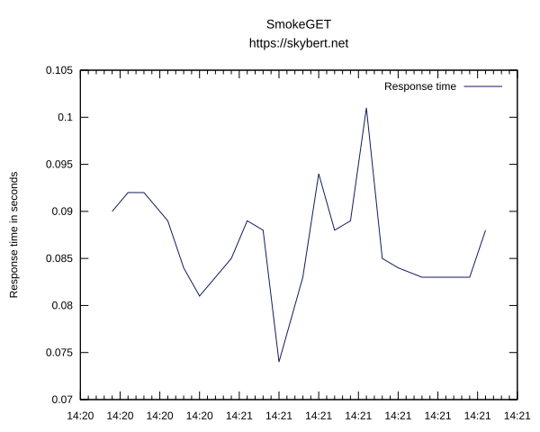

# SmokeGET - Zero conf server monitoring with nice graphs



## Usage
```text
$ smokeget --clear https://skybert.net
SmokeGET graph data dir: /tmp/smokeget/skybert.net
SmokeGET graph of https://stibodx.com: /tmp/smoke.svg
.................................EE...............................
```

If the server responds within `--max-time`, a dot is written and the
response time is noted on the graph. If not, an `E` is written to the
console.

## Options
```text
$ smokeget OPTIONS

OPTIONS
--clear       Clear data and graphs from previous runs
--data <file> Data file (optional)
--help        This screen
--max-time    Max total time to wait for a response from the server
--quiet       Don't write any dots or Es in the console
```


## Installation

`smokeget` needs `curl`:
```text
# pacman -S curl
```

If `.`s and `E`s are enough for you, you don't need to install
anything more, but in case you want SVG graphs, you must have
[gnuplot](http://www.gnuplot.info/) installed:

```text
# pacman -S gnuplot
```

## Motivation

> Why did you create this? There are so many tools that do this
> already?

Yes, that's what I thought too. I needed something to watch a few
websites while I was making some upgrades, but I couldn't find
anything. I really wanted to use
[smokeping](https://oss.oetiker.ch/smokeping/), but it required a
configuration file and some brain work. I also looked at nice tools
like [monit](https://mmonit.com/monit/), but that too needed
configuration files to be crafted. All I wanted was something *simple*
that I could install and run. Hence, the idea of `smokeget` was born:
zero conf, simple web site monitoring with a both ASCII output and
nice SVG graphis to present in meetings.
